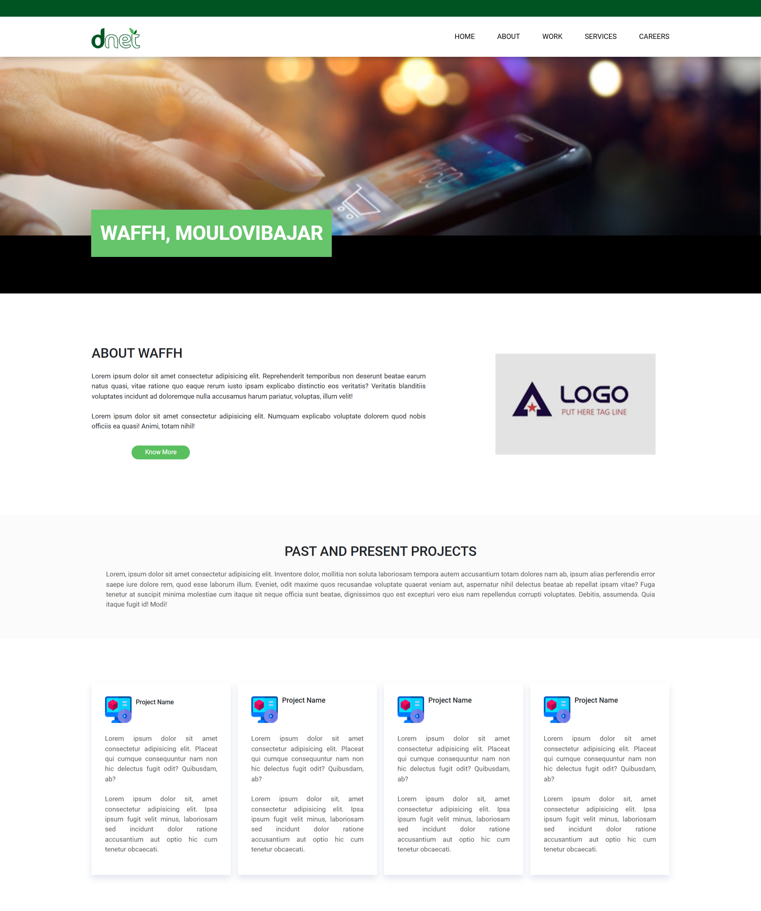

# Responsive Business Portfolio Website - PSD to HTML

This is a responsive business portfolio website created from a PSD design file. It showcases a clean, modern design that is fully responsive and optimized for all devices. The purpose of this project was to practice front-end development skills and create a pixel-perfect implementation of the design.

## 🚀 **Live Demo**
[**View the Website**](https://thecodemaster12.github.io/PSD-to-HTML-3/)

## 🌟 **Features**
- Fully responsive design for desktop, tablet, and mobile.
- Pixel-perfect implementation of the PSD design.
- Browser compatibility across major web browsers.
- Modern hover effects and transitions.

## 🖼️ **Screenshots**

 


## 🔧 **Technologies Used**
- HTML5
- CSS3
- Bootstrap
- JavaScript
- Lightbox
- Owl Carousel
- Match Height
- Photoshop

## 🛠️ **Getting Started**
To view the project locally:
1. Clone the repository:

```bash
git clone https://github.com/thecodemaster12/PSD-to-HTML-3.git
```
2. Open the `index.html` file in your browser.

## 📞 **Contact**
If you have any questions or feedback, feel free to reach out!
- [Email](mailto:email@example.com)
- [LinkedIn](https://www.linkedin.com/in/saifur-rahman-shihab/)
